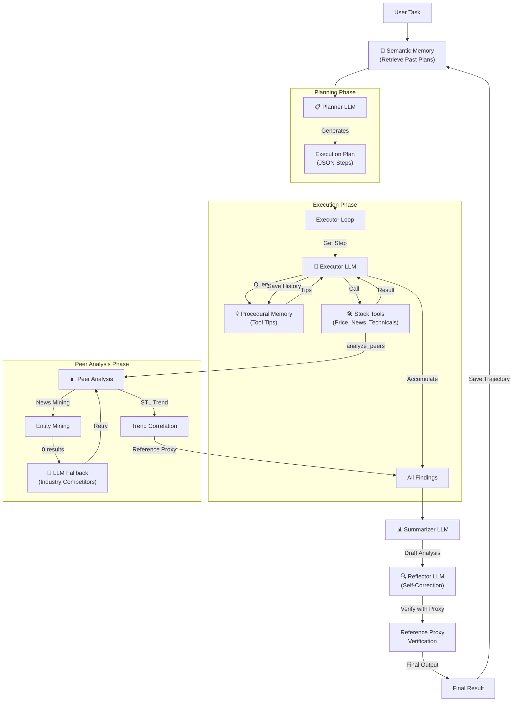

# Memento Agent Architecture Walkthrough

## Architecture Diagram



## Components

| Component | Method | Purpose |
|-----------|--------|---------|
| **Planner** | `_call_planner()` | Generates execution plan (JSON array) |
| **Executor** | `_call_executor()` | Interprets each tool result |
| **Summarizer** | `_call_summarizer()` | Creates final analysis |
| **Reflector** | `_call_reflector()` | Self-reviews + Reference Proxy verification |

## Memory Types

| Memory | Class | Purpose |
|--------|-------|---------|
| **Semantic** | `MemoryStore` | Planner: past plans & results |
| **Procedural** | `ProceduralMemory` | Executor: tool usage history |
| **Driver** | `DriverMemory` | Historical volatility drivers per stock |

---

## 📊 Peer Analysis System

### Workflow

```
1. Entity Mining (뉴스 기반)
   └── 뉴스에서 동시 언급된 기업 탐색
   
2. LLM Fallback (0건일 때)
   └── LLM이 Industry Benchmark 경쟁사 추론
   └── "삼성전자" → ["SK하이닉스", "마이크론"]
   
3. STL Trend Decomposition
   └── 60일 가격 → Seasonal-Trend-Loess 분해
   └── Trend Component 추출
   
4. Pearson Correlation
   └── Target vs Peer 트렌드 상관관계 계산
   
5. Reference Proxy 선정
   └── Correlation ≥ 0.7 → Reference Proxy
   └── Reflector 검증에 사용
```

### 사용자 지정 비교

| 입력 | 동작 |
|------|------|
| "삼성전자 분석해줘" | 뉴스 탐색 → LLM fallback (필요시) |
| "삼성전자 분석해줘 SK랑 비교해서" | SK하이닉스와 직접 비교 |

### Reflector 검증 로직

```
Reference Proxy 있음 + 신호 일치 → Confidence: High
Reference Proxy 있음 + 신호 불일치 → Confidence: Low  
Reference Proxy 없음 → Confidence: Medium
```

---

## Verification Results

**Test:** "삼성전자 분석해줘"

**Server Logs:**
```
📋 [Planner] Generating execution plan...
   ✅ Plan created with 6 steps
   ⚡ Executing: analyze_peers
   ⚠️ No peers found, using LLM fallback...
   🤖 LLM identified competitors: ["000660.KS", "MU"]
   ✅ Retry successful: 2 peers found
🔍 [Reflector] Self-reflection in progress...
   🔗 Reference Proxy Verified: SK하이닉스 (bullish)
   📋 Confidence Level: High
```

**Reflector Improvements:**
- Reference Proxy 트렌드와 신호 정렬 확인
- 불일치 시 WARNING 추가
- Confidence Level 기반 신뢰도 표시

