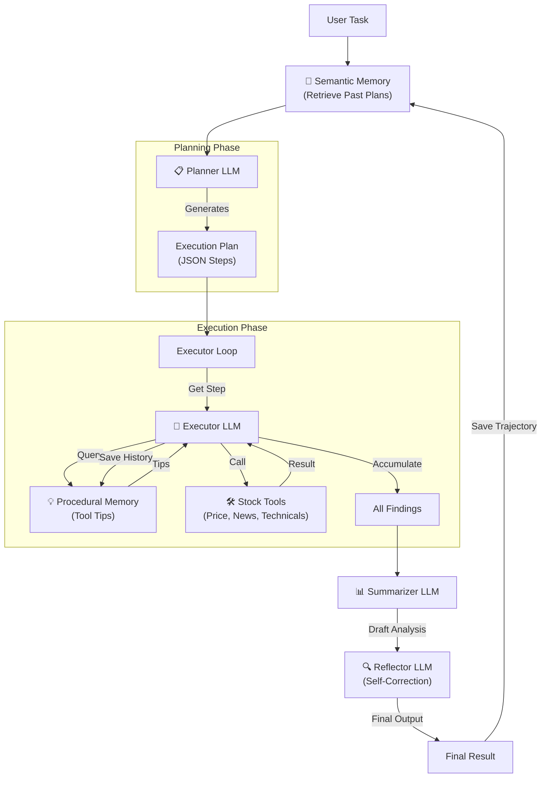
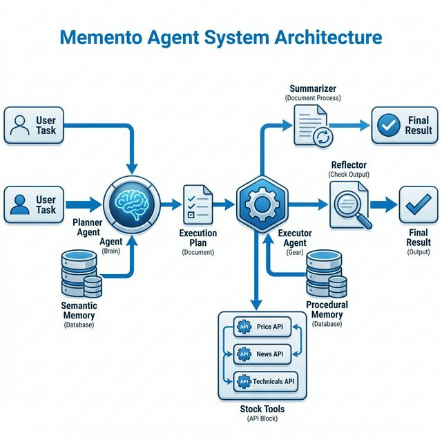

# Memento Agent Architecture Walkthrough

## Architecture Diagram



### Visual Diagram


## Components

| Component | Method | Purpose |
|-----------|--------|---------|
| **Planner** | `_call_planner()` | Generates execution plan (JSON array) |
| **Executor** | `_call_executor()` | Interprets each tool result |
| **Summarizer** | `_call_summarizer()` | Creates final analysis |
| **Reflector** | `_call_reflector()` | Self-reviews for consistency |

## Memory Types

| Memory | Class | Purpose |
|--------|-------|---------|
| **Semantic** | `MemoryStore` | Planner: past plans & results |
| **Procedural** | `ProceduralMemory` | Executor: tool usage history |

## Verification Results

**Test:** "삼성전자 분석해줘"

**Server Logs:**
```
📋 [Planner] Generating execution plan...
   ✅ Plan created with 7 steps
   ⚡ Executing: stock_price
🔧 [Executor] Processing step 1: stock_price
... (6 more steps)
📊 [Planner] Generating final summary...
🔍 [Reflector] Self-reflection in progress...
   📝 Analysis revised after reflection
```

**Reflector Caught:**
- MACD bearish vs overall bullish inconsistency
- Missing RSI/Bollinger explanation
- Over-specific price forecast

**Result:** Analysis revised with corrections before returning to user.
